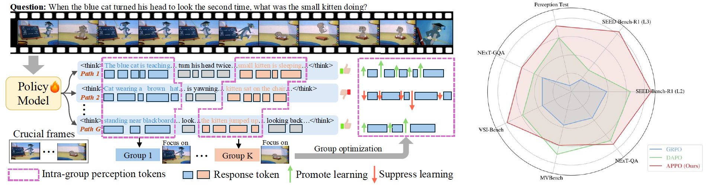

<!-- <p align="center">
    
<p> -->


<h3 align="center"> (CVPR'26) <a href="" style="color:#9C276A">
APPO: Attention-guided Perception Policy Optimization for Video Reasoning
</a></h3>


<h5 align="center"> 🚀🚀 Welcome to the repo of APPO! If our project helps you, please give us a star ⭐ on GitHub to support us. 🙏🙏 </h2>

<h5 align="center">


[](https://huggingface.co/CserDu123/ARPO) [](https://arxiv.org/abs/2602.23823)<br>



## 📰 News

* **[2026.03.18]**   Release training and evaluation codes of Crab.
* **[2026.02.20]**   APPO has been accepted to CVPR 2026.


<!-- <div align="center"><video src="https://www.youtube.com/watch?v=O57xewSvOj4" ></div> -->


## 🛠️ Requirements and Installation
Basic Dependencies:
* Python == 3.10
* trl == 0.23.1
* transformers == 4.52.3
* deepspeed == 0.16.4
* accelerate == 1.8.1

Install required packages:
```bash
git clone git@github.com:GeWu-Lab/APPO.git
cd APPO
pip install -r requirements.txt
```

## 🗝️ RL Training
  
Training on Seed-Bench-R1 or Video-R1 data:
```bash
bash scripts/qwen2_5_vl_rl.sh
```

Training on NeXT-GQA data:
```bash
bash scripts/qwen2_5_vl_rl_tvg.sh
``` 


## 📑 Citation
If you find APPO useful for your research and applications, please cite using this BibTeX:
```bibtex
@article{du2026appo,
  title={APPO: Attention-guided Perception Policy Optimization for Video Reasoning},
  author={Du, Henghui and Zhou, Chang and Chen, Xi and Hu, Di},
  journal={arXiv preprint arXiv:2602.23823},
  year={2026}
}
```

## 🔒 License

This project is released under the Apache 2.0 license as found in the LICENSE file.
Please get in touch with us if you find any potential violations.
